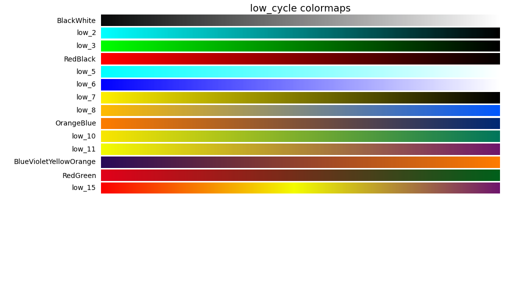
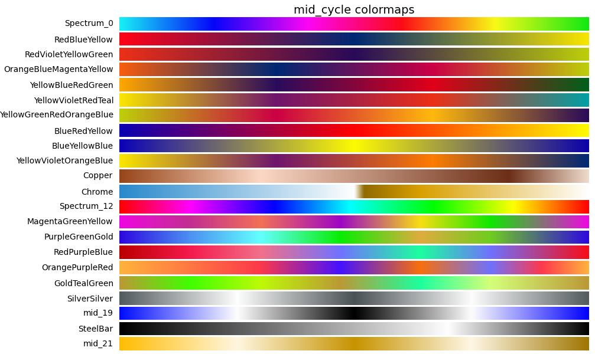
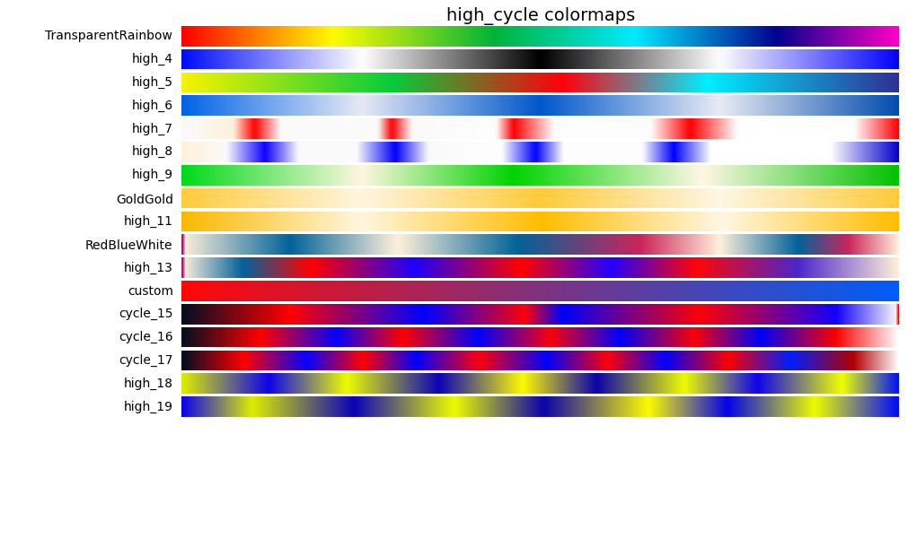

### Purpose
This is a Python port of the [ORI Advanced Forensic Actions tools](http://ori.hhs.gov/advanced-forensic-actions).

The original version was developed as an Adobe Photoshop CS4-CS5 plugin; 
this port was motivated by a desire to make these tools usable without 
software licensing fees. 
This port is provided without warranty, and was produced without affiliation 
or endorsement from the Office of Research Integrity or original authors.

Some sample data was taken from the description of methods in the affidavit of 
John W. Kruger, [Case No. 14-013099-CZ](http://retractionwatch.com/wp-content/uploads/2014/12/2014.12.10-PubPeer-Motion-to-Quash-Ex-B-Krueger-Affidavit.pdf). 

### Installation
The user must have Python 2.7 or 3.x installed on their computer. 
Additional dependencies can be installed using the following command:

`pip install -r requirements.txt`

MS Windows users may need to download precompiled binary versions from the 
relevant project websites.

### Usage
#### Using colormaps in python & matplotlib
Gradients can be imported for use in scripts with matplotlib. A sample 
command-line tool is provided in the folder `python/`, which applies a 
named gradient to the image specified:

`python apply_lut.py image_filename.png --lut COLORMAPNAME`
 
For a list of all recognized colormaps, use 

`python apply_lut.py -h`

#### Web tool
For quick experimentation, a browser-based tool is also provided. This allows 
you to load an image from your local hard drive and apply multiple gradients 
in rapid succession, without any further post-processing. 

### About the gradients
Low Cycle Gradients feature a slow transition from one color to another.

Mid Cycle Gradients transition between several colors over a broad range.

High cycle gradients rapidly swap between multiple colors. The same color may 
appear more than once. These gradients will most amplify small differences 
in local contrast, but some colors may appear more than once.

