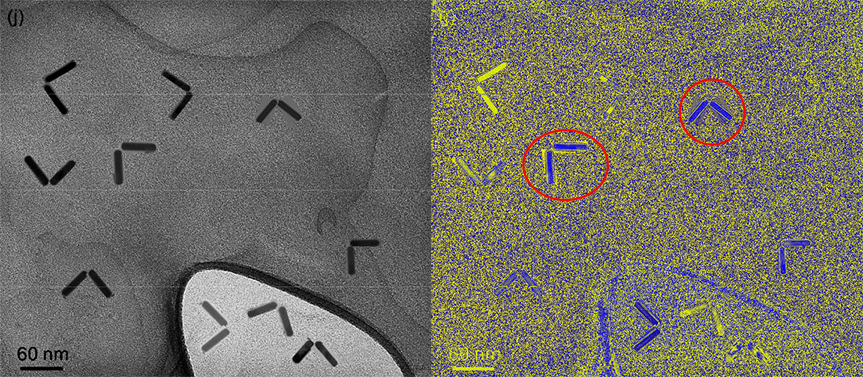

### Purpose
This represents the beginnings of a Python port of the 
[ORI Advanced Forensic Actions tools](http://ori.hhs.gov/advanced-forensic-actions).

The original version was developed as an Adobe Photoshop CS4-CS5 plugin; 
this effort was motivated by a desire to make these tools usable without 
software licensing fees. 
This port is provided without warranty, and was produced without affiliation 
or endorsement from the Office of Research Integrity or original authors.

Below is an example from a 
[retracted publication](http://retractionwatch.com/2013/08/16/nano-letters-retracts-chopstick-nanorod-paper-questioned-this-week-on-chemistry-blogs/). 
(adapted from [DOI: 10.1021/nl400959z](http://dx.doi.org/10.1021/nl400959z), Copyright 2013 American Chemical Society). 
Applying a high-cycle colormap (high_18) emphasizes contrast differences 
near the boundaries of two nanoparticle rods.

### Status
To date, only the gradient LUT (colormap) data has been extracted. 
These gradients can be used as part of a larger analysis chain in 
python/matplotlib, or in a simple web-based tool.

Issue reports, feature requests, and code enhancements (via pull requests) 
are welcome.

### Installation
The user must have Python 2.7 or 3.x installed on their computer. 
Additional dependencies can be installed using the following command:

`pip install -r requirements.txt`

MS Windows users may need to download precompiled binary versions from the 
relevant project websites.

### Usage
#### Using colormaps in python & matplotlib
Gradients can be imported for use in scripts with matplotlib, as part of a 
larger analysis toolchain. A sample command-line tool is provided in the 
folder `python/`, which applies a named gradient to the image specified:

`python apply_lut.py image_filename.png --lut COLORMAPNAME`
 
For a list of all recognized colormaps, use 

`python apply_lut.py -h`

#### Web tool
For quick experimentation, a browser-based tool is also provided. This allows 
you to load an image from your local hard drive and experiment with different 
gradients (multiple gradients may be needed to see all relevant features). The modified image 
can then be saved.

A [live demo](http://occsci.com/tools/recolor/) of the web tool is available.

### About the gradients
Low Cycle Gradients feature a slow transition from one color to another.

Mid Cycle Gradients transition between several colors over a broad range.

High cycle gradients rapidly swap between multiple colors. These gradients 
will most amplify small differences in local contrast, but some colors may 
appear more than once.

### Acknowledgements
Lookup tables were developed by the Office of Research Integrity and 
released as part of the Advanced Forensic Actions 
[ORI Advanced Forensic Actions tools](http://ori.hhs.gov/advanced-forensic-actions) 
tool suite. 

Colormap data was extracted and converted using the 
[grd_to_cmap](https://github.com/abought/grd_to_cmap) conversion utility, 
based on code from the RE-lab team.

### Further reading
To learn more about how these tools (including gradient LUTs) can be applied 
for fraud detection, see the description of methods in the affidavit of 
John W. Kruger, [Case No. 14-013099-CZ](http://retractionwatch.com/wp-content/uploads/2014/12/2014.12.10-PubPeer-Motion-to-Quash-Ex-B-Krueger-Affidavit.pdf). 
